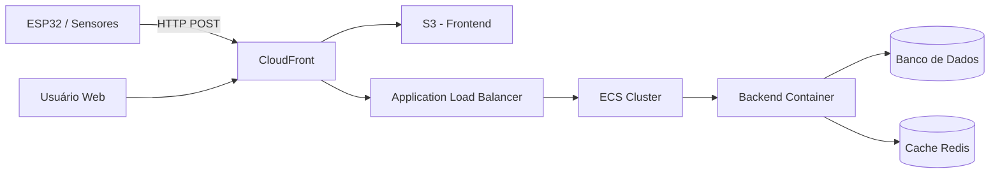

# ADR-001: Arquitetura de Monitoramento da Horta (IoT + Cloud)

## Status

Accepted

## Contexto

O projeto consiste em um sistema de monitoramento de uma horta utilizando um ESP32 para coleta de dados (umidade do solo, temperatura, etc.), com envio dessas informações para a nuvem e visualização em uma aplicação web.

Requisitos principais:

- Coleta periódica de dados dos sensores
- Envio confiável para a nuvem
- Visualização em tempo real (ou quase)
- Baixo custo e fácil manutenção
- Possibilidade de escalar futuramente

---

## Decisão

Adotar uma arquitetura baseada em:

- ESP32 enviando dados via HTTP
- Backend containerizado rodando em AWS usando ECS
- Balanceamento via Application Load Balancer (ALB)
- Frontend estático hospedado no S3 e distribuído via CloudFront
- Persistência em banco de dados (RDS ou similar)
- Uso opcional de cache (Redis) para tempo real

---

## Alternativas consideradas

### 1. Arquitetura Serverless (Lambda + API Gateway)

- Alta escalabilidade
- Complexidade maior para WebSocket e estado
- Custo imprevisível dependendo da frequência

### 2. Backend em EC2 (sem containers)

- Simples inicialmente
- Baixa escalabilidade
- Gestão manual de infraestrutura

### 3. Uso de IoT Core

- Ideal para IoT em larga escala
- Overkill para MVP acadêmico
- Curva de aprendizado maior

---

## Consequências

### Positivas

- Arquitetura escalável e moderna
- Separação clara entre frontend e backend
- Facilidade de deploy com containers
- Integração com serviços gerenciados

### Negativas

- Maior complexidade inicial
- Necessidade de configuração de rede (VPC, SG, etc.)
- Custo maior que soluções serverless em baixo uso

---

## Diagrama da Arquitetura

